# Disease spreading through US air transport network

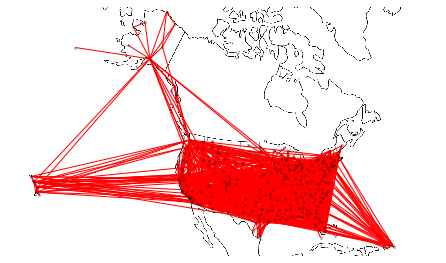

the US airport transport network based on the flight data is visulized as the above map.

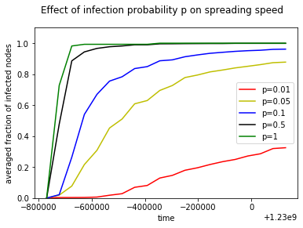

The stepwise in the curves are affected by process of epidemic spreading on important nodes. Different nodes have different infection capabilities. Once important nodes are infected, the spread of the epidemic will be accelerated. Besides, the stepwise would be affected by the time intervals. Here I divided the whole time span into 20 equal-sized steps. If we use smaller time intervals to calculate the number of nodes, the curve would look more smoothly 

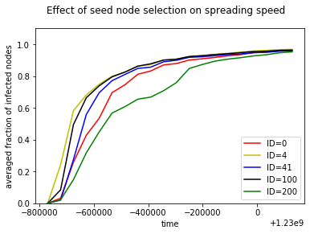
The differences in spreading speed for each seed node are visible at the beginning of the epidemic. The process of epidemic spreading is from the seed to its neighbors and then to the whole network, so in the beginning, the process is mainly affected by the seed node and its neighbors. Once the epidemic spreads throughout the majority of the network, it already doesn’t matter who is the seed node, who spreads first.

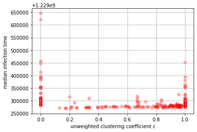
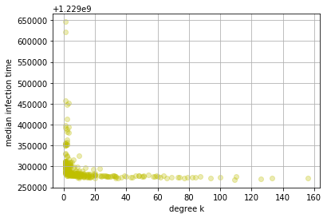
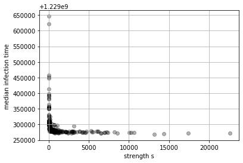
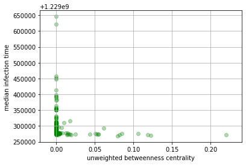

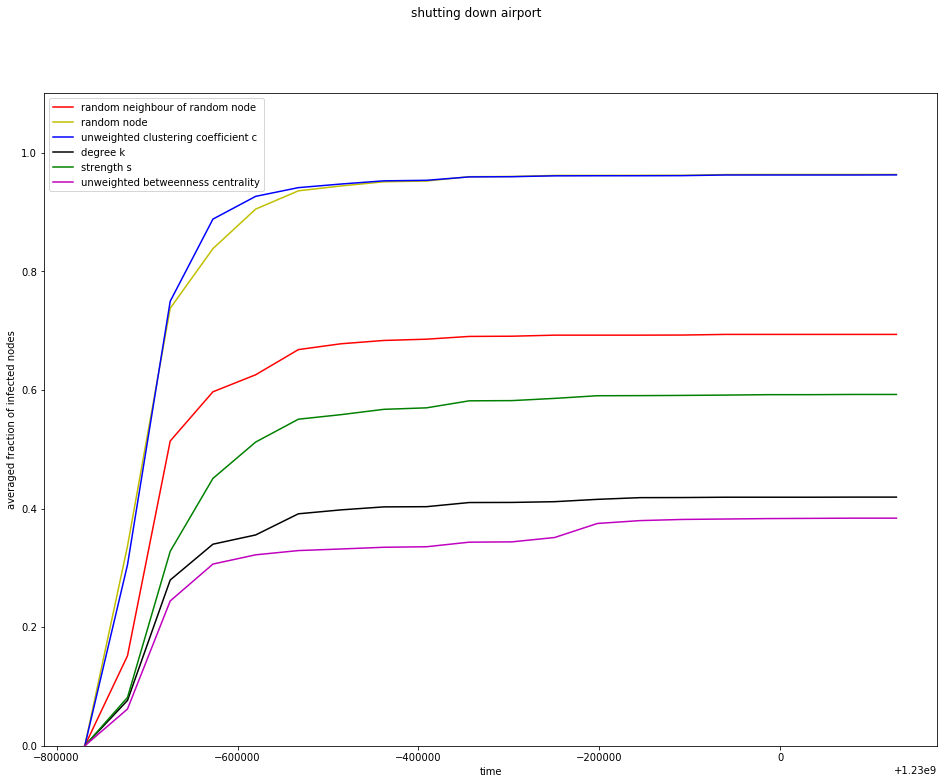

In the comparison of four correlation values, we can see that the ranking of the immunization strategies is No.1- unweighted betweenness centrality, No.2-degree k, No.3-strength s, No.4-random neighbor of random node, No.5-random node, No.6-unweighted clustering coefficient c. 

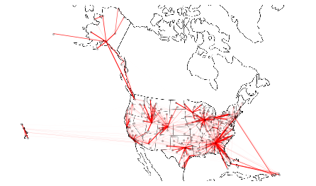

The maximal spanning tree of the network is following map.

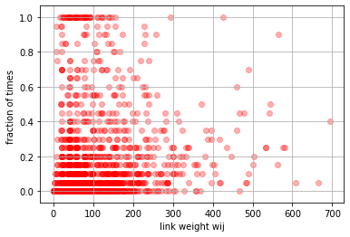
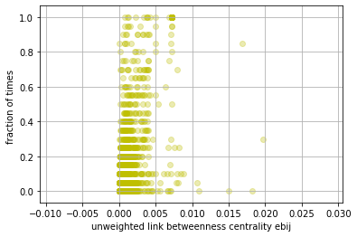

The above are scatter plots showing f_ij as functions of link properties. 	But none of the two predictor are very good at predicting f_ij. In comparison, unweighted link betweenness centrality 〖eb〗_ij has better performance than link weight w_ij.

